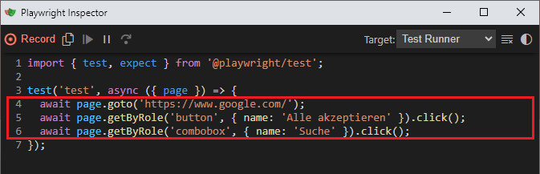

# UI Load Testing

This repository gives the opportunity for quick UI load testing. It lets you record a usage scenario in the browser as
a __Playwright Test__ to then execute a __Artillery Load Test__.

## Installation

> Prerequisite: Installed [NodeJS](https://nodejs.org/en/download)

```shell
npm install
```

## Usage

### 1. Generate Playwright Test

Start the __Playwright Code Generator__ with the `URL` of the interested website.

```shell
npx playwright codegen https://www.google.com/
```

Copy the generated code into the `function usageScenario(page)` of
the [playwright-scenario.js](src/playwright-scenario.js).



Edit the code with potentially `await sleep(ms);` to make the scenario more realistic. 

### 2. Run Artillery Script

Adjust [artillery-script.yml](src/artillery-script.yml) with a custom scenario like the [options.yml](src/options.yml)
and run it:

```shell
npm run artillery
```

## References

* [Artillery Playwright Reference](https://www.artillery.io/docs/reference/engines/playwright)
* [Playwright Code Generator](https://playwright.dev/docs/codegen)
